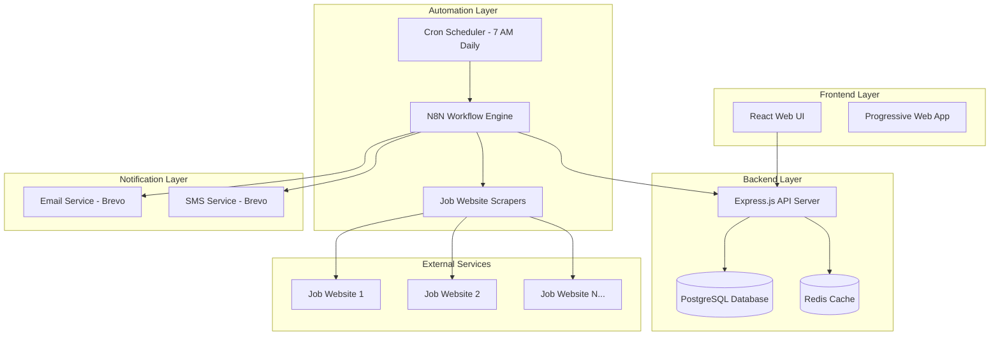

# Design Document: Job Finder System

## Overview

The Job Finder System is a comprehensive automated job search and alerting platform consisting of three main components: a React-based web UI for managing job search preferences, a Node.js/Express backend API for data management, and an N8N workflow for automated job scraping and intelligent matching. The system monitors multiple job websites daily at 7 AM and sends targeted alerts only when jobs match the user's exact criteria.

## Architecture

### High-Level Architecture



### Technology Stack

**Frontend:**

- React 18 with TypeScript
- Material-UI (MUI) for component library
- React Hook Form for form management
- React Query for API state management

**Backend:**

- Node.js with Express.js
- PostgreSQL for primary data storage
- Redis for caching and session management
- JWT for authentication
- Joi for input validation

**Automation:**

- N8N for workflow orchestration
- Puppeteer for web scraping
- Cron scheduling for daily execution

**Notifications:**

- Brevo (formerly Sendinblue) for email and SMS delivery

## Components and Interfaces

### Frontend Components

#### 1. Job Preferences Manager

```typescript
interface JobPreferences {
  id: string;
  profileName: string;
  jobTitle: string;
  keywords: string[];
  location: {
    city?: string;
    state?: string;
    country?: string;
    remote: boolean;
  };
  contractTypes: ("permanent" | "contract" | "freelance" | "internship")[];
  salaryRange: {
    min?: number;
    max?: number;
    currency: string;
  };
  dayRateRange: {
    min?: number;
    max?: number;
    currency: string;
  };
  experienceLevel: ("entry" | "mid" | "senior" | "executive")[];
  companySize: ("startup" | "small" | "medium" | "large")[];
  isActive: boolean;
  createdAt: Date;
  updatedAt: Date;
}
```

#### 2. Job History Viewer

```typescript
interface JobMatch {
  id: string;
  jobTitle: string;
  company: string;
  location: string;
  salary?: string;
  contractType: string;
  jobUrl: string;
  sourceWebsite: string;
  matchedProfileId: string;
  foundAt: Date;
  applicationStatus:
    | "not_applied"
    | "applied"
    | "interviewed"
    | "rejected"
    | "offered";
  alertSent: boolean;
}
```

#### 3. Notification Settings

```typescript
interface NotificationSettings {
  userId: string;
  email: {
    enabled: boolean;
    address: string;
    consolidateDaily: boolean;
  };
  sms: {
    enabled: boolean;
    phoneNumber: string;
  };
  quietHours: {
    enabled: boolean;
    startTime: string; // HH:MM format
    endTime: string; // HH:MM format
  };
}
```

### Backend API Endpoints

#### Authentication & User Management

```typescript
POST / api / auth / register;
POST / api / auth / login;
POST / api / auth / logout;
GET / api / auth / profile;
PUT / api / auth / profile;
```

#### Job Preferences Management

```typescript
GET    /api/preferences          // Get all user preferences
POST   /api/preferences          // Create new preference profile
GET    /api/preferences/:id      // Get specific preference
PUT    /api/preferences/:id      // Update preference
DELETE /api/preferences/:id      // Delete preference
POST   /api/preferences/:id/toggle // Toggle active status
```

#### Job History & Matches

```typescript
GET    /api/jobs/matches         // Get job matches with pagination
GET    /api/jobs/matches/:id     // Get specific job match
PUT    /api/jobs/matches/:id/status // Update application status
GET    /api/jobs/statistics      // Get user job search statistics
```

#### Notification Settings

```typescript
GET / api / notifications / settings;
PUT / api / notifications / settings;
POST / api / notifications / test; // Send test notification
```

#### N8N Integration Endpoints

```typescript
GET / api / n8n / preferences; // Get all active preferences for N8N
POST / api / n8n / jobs / found; // N8N posts found jobs
POST / api / n8n / jobs / matches; // N8N posts job matches
GET / api / n8n / websites; // Get configured job websites
```

### N8N Workflow Architecture

#### Core Workflow Nodes

1. **Cron Trigger Node**

   - Executes daily at 7:00 AM
   - Timezone-aware scheduling

2. **Preference Fetcher Node**

   - HTTP Request to `/api/n8n/preferences`
   - Retrieves all active job search profiles

3. **Website Iterator Node**

   - Loops through configured job websites
   - Parallel processing for efficiency

4. **Job Scraper Nodes**

   - Site-specific scraping logic
   - Handles different website structures
   - Rate limiting and error handling

5. **Job Matcher Node**

   - Compares scraped jobs against user criteria
   - Implements fuzzy matching for job titles
   - Salary range validation
   - Location matching logic

6. **Duplicate Detector Node**

   - Checks against existing job matches
   - Prevents duplicate alerts

7. **Notification Router Node**

   - Routes to appropriate notification channels
   - Respects user notification preferences
   - Handles quiet hours

8. **Alert Sender Nodes**
   - Email sender (Brevo)
   - SMS sender (Brevo)

## Data Models

### Database Schema

#### Users Table

```sql
CREATE TABLE users (
  id UUID PRIMARY KEY DEFAULT gen_random_uuid(),
  email VARCHAR(255) UNIQUE NOT NULL,
  password_hash VARCHAR(255) NOT NULL,
  first_name VARCHAR(100),
  last_name VARCHAR(100),
  created_at TIMESTAMP DEFAULT CURRENT_TIMESTAMP,
  updated_at TIMESTAMP DEFAULT CURRENT_TIMESTAMP
);
```

#### Job Preferences Table

```sql
CREATE TABLE job_preferences (
  id UUID PRIMARY KEY DEFAULT gen_random_uuid(),
  user_id UUID REFERENCES users(id) ON DELETE CASCADE,
  profile_name VARCHAR(100) NOT NULL,
  job_title VARCHAR(200),
  keywords TEXT[], -- Array of keywords
  location JSONB, -- Flexible location data
  contract_types TEXT[], -- Array of contract types
  salary_range JSONB, -- {min, max, currency}
  day_rate_range JSONB, -- {min, max, currency}
  experience_levels TEXT[],
  company_sizes TEXT[],
  is_active BOOLEAN DEFAULT true,
  created_at TIMESTAMP DEFAULT CURRENT_TIMESTAMP,
  updated_at TIMESTAMP DEFAULT CURRENT_TIMESTAMP
);
```

#### Job Matches Table

```sql
CREATE TABLE job_matches (
  id UUID PRIMARY KEY DEFAULT gen_random_uuid(),
  preference_id UUID REFERENCES job_preferences(id) ON DELETE CASCADE,
  job_title VARCHAR(300) NOT NULL,
  company VARCHAR(200),
  location VARCHAR(200),
  salary VARCHAR(100),
  contract_type VARCHAR(50),
  job_url TEXT NOT NULL,
  source_website VARCHAR(100) NOT NULL,
  job_description TEXT,
  requirements TEXT,
  found_at TIMESTAMP DEFAULT CURRENT_TIMESTAMP,
  application_status VARCHAR(20) DEFAULT 'not_applied',
  alert_sent BOOLEAN DEFAULT false,
  job_hash VARCHAR(64) UNIQUE -- For duplicate detection
);
```

#### Notification Settings Table

```sql
CREATE TABLE notification_settings (
  user_id UUID PRIMARY KEY REFERENCES users(id) ON DELETE CASCADE,
  email_enabled BOOLEAN DEFAULT true,
  email_address VARCHAR(255),
  email_consolidate_daily BOOLEAN DEFAULT false,
  sms_enabled BOOLEAN DEFAULT false,
  sms_phone_number VARCHAR(20),
  quiet_hours_enabled BOOLEAN DEFAULT false,
  quiet_hours_start TIME,
  quiet_hours_end TIME,
  created_at TIMESTAMP DEFAULT CURRENT_TIMESTAMP,
  updated_at TIMESTAMP DEFAULT CURRENT_TIMESTAMP
);
```

#### Job Websites Configuration Table

```sql
CREATE TABLE job_websites (
  id UUID PRIMARY KEY DEFAULT gen_random_uuid(),
  name VARCHAR(100) NOT NULL,
  base_url VARCHAR(500) NOT NULL,
  search_url_template VARCHAR(1000) NOT NULL,
  scraping_config JSONB, -- Site-specific scraping configuration
  is_active BOOLEAN DEFAULT true,
  rate_limit_ms INTEGER DEFAULT 2000,
  created_at TIMESTAMP DEFAULT CURRENT_TIMESTAMP
);
```

Now I need to use the prework tool to analyze the acceptance criteria before writing the correctness properties:

<function_calls>
<invoke name="prework">
<parameter name="featureName">job-finder

## Correctness Properties

_A property is a characteristic or behavior that should hold true across all valid executions of a system—essentially, a formal statement about what the system should do. Properties serve as the bridge between human-readable specifications and machine-verifiable correctness guarantees._

### Property Reflection

After analyzing all acceptance criteria, I identified several areas where properties can be consolidated:

- Job matching properties (4.2-4.5) can be combined into comprehensive matching validation
- Alert content properties (5.2, 5.4) overlap and can be unified
- Profile management properties (6.1-6.5) share common data persistence patterns
- N8N workflow properties (7.2, 7.3) both test configuration capabilities

### Core Properties

**Property 1: Job Preference Persistence**
_For any_ valid job preference data, saving the preferences should result in the same data being retrievable from the database with a unique identifier
**Validates: Requirements 1.2, 1.8, 6.2**

**Property 2: Keyword Input Parsing**
_For any_ comma-separated keyword string, the system should correctly parse and store individual keywords while handling various whitespace and delimiter combinations
**Validates: Requirements 1.4**

**Property 3: Salary Range Validation**
_For any_ salary range input where minimum is less than or equal to maximum, the system should accept and store the range correctly
**Validates: Requirements 1.6, 1.7**

**Property 4: Multi-Website Monitoring**
_For any_ set of configured job websites, the N8N workflow should attempt to query each active website and handle failures gracefully without stopping execution for other sites
**Validates: Requirements 2.1, 2.2, 2.5**

**Property 5: Job Data Normalization**
_For any_ job data extracted from different websites, the normalization process should produce consistent output format regardless of the source website structure
**Validates: Requirements 2.4**

**Property 6: Incremental Job Processing**
_For any_ workflow execution, only jobs posted after the last successful execution timestamp should be processed for matching
**Validates: Requirements 3.3**

**Property 7: Execution Logging**
_For any_ workflow execution outcome (success or failure), appropriate log entries should be created with execution details and any errors encountered
**Validates: Requirements 3.4**

**Property 8: Retry Logic**
_For any_ failed workflow execution, a retry should be scheduled within 30 minutes of the failure
**Validates: Requirements 3.5**

**Property 9: Comprehensive Job Matching**
_For any_ job and user criteria combination, a job should only be considered a match when ALL specified criteria (title keywords, location, salary range, contract type) are satisfied
**Validates: Requirements 4.1, 4.2, 4.3, 4.4, 4.5**

**Property 10: Alert Triggering Logic**
_For any_ job that matches all user criteria, an alert should be sent, and for any job that doesn't match all criteria, no alert should be sent
**Validates: Requirements 4.6, 4.7**

**Property 11: Alert Content Completeness**
_For any_ job alert sent, the message should include job title, company name, location, salary information, and application link in a clearly formatted structure
**Validates: Requirements 5.2, 5.4**

**Property 12: Alert Consolidation**
_For any_ multiple matching jobs found in a single execution, they should be sent as a consolidated alert rather than individual notifications
**Validates: Requirements 5.3**

**Property 13: Notification Delivery Tracking**
_For any_ alert sent, the delivery status should be tracked and failed notifications should trigger retry attempts
**Validates: Requirements 5.5**

**Property 14: Profile Management Operations**
_For any_ profile management operation (create, edit, delete), the system should maintain data consistency and update monitoring status appropriately
**Validates: Requirements 6.1, 6.3, 6.4**

**Property 15: Profile Status Display**
_For any_ user with job search profiles, the UI should display all profiles with their current active status and relevant metadata
**Validates: Requirements 6.5**

**Property 16: N8N Workflow Configuration**
_For any_ N8N workflow import, the workflow should successfully connect to the database and support adding new job websites through configuration parameters
**Validates: Requirements 7.2, 7.3**

**Property 17: Job Storage and Search**
_For any_ matching job found, it should be stored in the database with searchable metadata and duplicate detection should prevent redundant storage
**Validates: Requirements 8.1, 8.2**

**Property 18: Job History Display**
_For any_ job in the user's history, the display should include job title, company, date found, and current application status
**Validates: Requirements 8.3**

**Property 19: Application Status Management**
_For any_ job marked as applied, the status should be updated in the database and the job should be excluded from future alert matching
**Validates: Requirements 8.4**

**Property 20: Data Retention Policy**
_For any_ job stored in the system, it should remain accessible for at least 90 days from the date it was found
**Validates: Requirements 8.5**

## Error Handling

### Frontend Error Handling

**Form Validation Errors:**

- Real-time validation for all input fields
- Clear error messages for invalid salary ranges, malformed keywords, etc.
- Graceful handling of network connectivity issues

**API Communication Errors:**

- Retry logic for failed API requests
- Offline mode with local storage fallback
- User-friendly error messages for server errors

### Backend Error Handling

**Database Errors:**

- Connection pool management with automatic reconnection
- Transaction rollback for failed operations
- Detailed error logging with correlation IDs

**External Service Errors:**

- Circuit breaker pattern for notification services
- Fallback notification channels when primary fails
- Rate limiting compliance for third-party APIs

### N8N Workflow Error Handling

**Website Scraping Errors:**

- Individual website failures don't stop entire workflow
- Automatic retry with exponential backoff
- Error categorization (temporary vs permanent failures)

**Data Processing Errors:**

- Validation of scraped data before processing
- Graceful handling of malformed job postings
- Logging of data quality issues for monitoring

## Testing Strategy

### Dual Testing Approach

The system will use both unit testing and property-based testing to ensure comprehensive coverage:

**Unit Tests:**

- Specific examples and edge cases for UI components
- Integration tests for API endpoints
- Mock-based tests for external service integrations
- Database transaction testing

**Property-Based Tests:**

- Universal properties across all inputs using fast-check library
- Minimum 100 iterations per property test
- Each test tagged with: **Feature: job-finder, Property {number}: {property_text}**
- Comprehensive input coverage through randomization

**Testing Configuration:**

- Jest for unit testing framework
- fast-check for property-based testing
- Supertest for API integration testing
- React Testing Library for component testing

**Key Testing Areas:**

- Job matching algorithm validation
- Data persistence and retrieval
- N8N workflow configuration validation
- Notification delivery reliability
- UI form validation and user interactions

### N8N Workflow Testing

**Manual Testing Endpoints:**

- Webhook triggers for testing individual workflow components
- Test data injection for validation scenarios
- Monitoring dashboard for execution tracking

**Automated Testing:**

- Scheduled test executions with known data sets
- Performance monitoring for large-scale job processing
- Alert delivery verification through test notification channels
